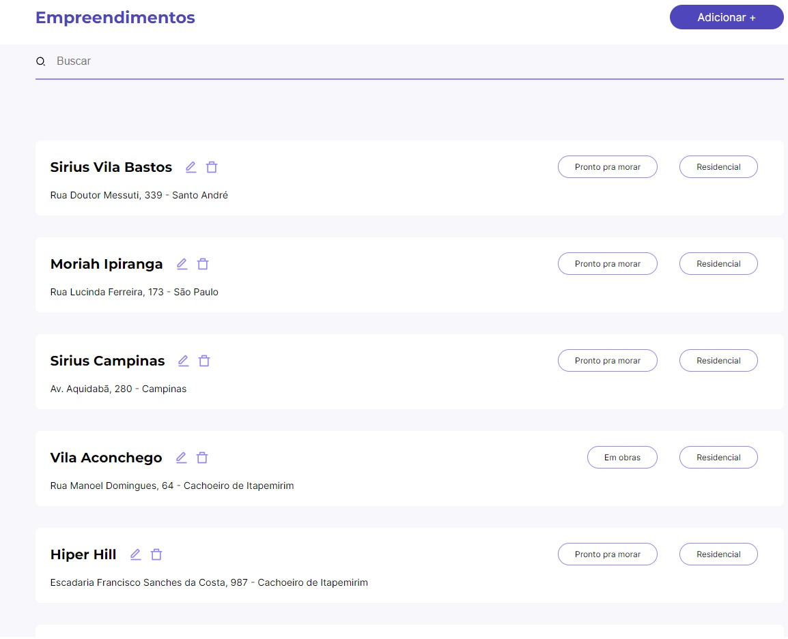
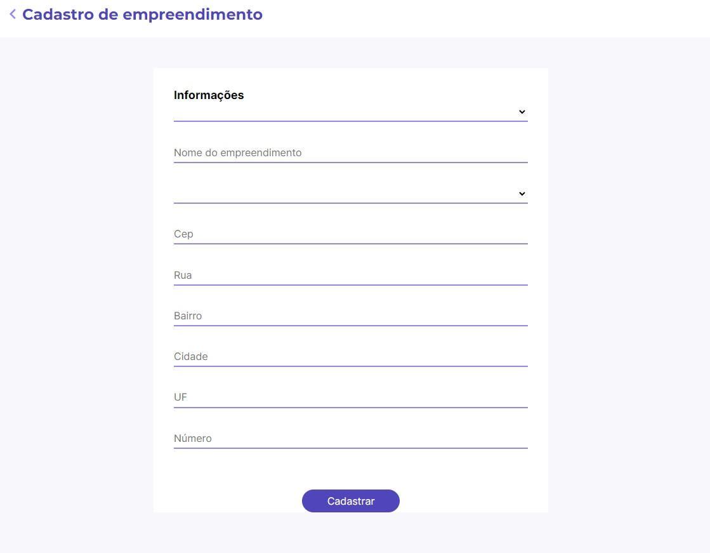

<h1>Frontend Challenge</h1>

## Tópicos 

[Sobre o Sobre o Frontend Challenge](#Sobre-o-Frontend-Challenge)

[Missão](#missão)

[Extras](#extras)

[Imagens](#imagens)

[Tecnologias](#tecnologias)

[Instalação e uso](#instalação-e-uso)

<br>

## Sobre o Frontend Challenge
Esse projeto e sobre um desafio de teste pra uma vaga aonde foi me passado:
No desafio consiste em o usuário ter uma lista de empreendimentos cadastrados. Nesse site deve haver a possibilidade do usuario listar os empreendimentos, criar novos empreendimentos, editar empreendimento, e apagar empreendimento;
Extras: Sera possível também filtrar pelo nome, e ter paginação com limitação de 10 empreendimentos para cada clique em "carregar mais".
Quando possível componentizar o código, identificando botões e estruturas que se repetem.
Os dados serão servidos via um Fake api que esta nesse repositório(enterprises-server).
Utilize o figma como base para o cadastro e exibição de dados. FIGMA do Projeto
Para consulta do CEP poderá utilizar API pública [ViaCEP](https://viacep.com.br/) 

<h5>Foi usado a aba Projects no repositorio do GitHub para acompanhar Sobre Metodologias Ageis</h5>
<br>

<h2>Para rodar a Fake api:</h2>
yarn add json-server

adicionam o seguinte script no package.json:
"server": "json-server --watch enterprises-server.json --port 3001"

Rodar server: yarn server
estará rodando em http://localhost:3001/

## Missão
✔️ Criar uma aplicação NextJS
✔️ Rodar na web
✔️ Utilizar Typescript
✔️ Listar Empreendimentos
✔️ Criar Empreendimento
✔️ Editar Empreendimento
✔️ Deletar Empreendimento
✔️ Styled-components para construção do layout
✔️ Responsivo
✔️ Subir no github
<br>

## Extras
✔️ Utilizar o getServerSideProps
✔️ utilizar o axios
✔️ Filtrar pelo nome do empreendimento.
❎ Paginação.


## Imagens
<p align="center">
  
</p>

<br>
<br>
<br>

<p align="center">
  
</p>

## Tecnologias

Tecnologias e ferramentas utilizadas no desenvolvimento do projeto:

- [NextJs](https://nextjs.org/)
- [TypeScript](https://www.typescriptlang.org/)
- [Styled Components](https://styled-components.com/)
- [React Hook Form](https://www.react-hook-form.com)
- [Yup](https://github.com/jquense/yup)
- [Axios](https://github.com/axios/axios)
- [React Icons](https://github.com/react-icons/react-icons#readme)

<br>

## Instalação e uso

```bash
# Abra um terminal e copie este repositório com o comando
git clone https://github.com/3ddybr/FrontendChallenge.git
# ou use a opção de download.

# Entre na pasta web com 
cd frontendChallenge

# Instale as dependências
yarn install

# Rode a aplicação
yarn start
yarn server
```
<br>